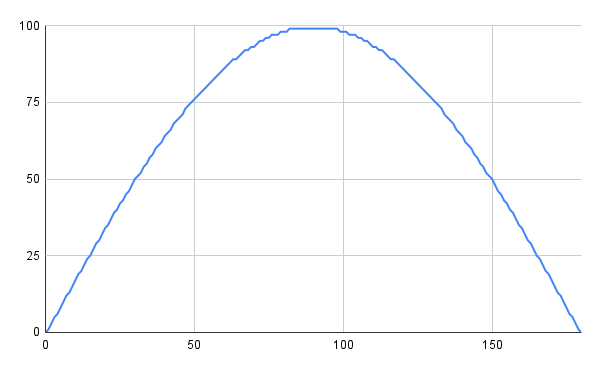

# CORDIC sin_pwm

CORDICで実装したsinを即座に計算して100倍して8bitで出力してくれるやつ


## Features

* sin_pwm.svが本体
* 入力8bit, 出力8bit
* 0°~180°まで対応
* 181°以上を入力したら死ぬ

## usage

こんな感じで使ってもろて

```SystemVerilog
module test_module (...);

    sin_pwm sin(
        .theta( kakudo ),
        .duty( du_ty )
    );

endmodule
```

以下を実行すると0~180を入力した時のシミュレーションを見られる
```
make ; make run
``` 
